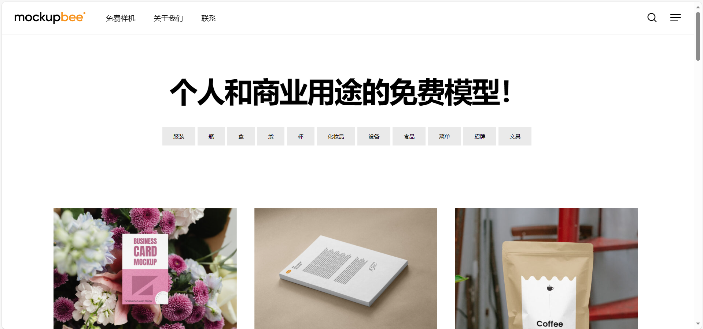
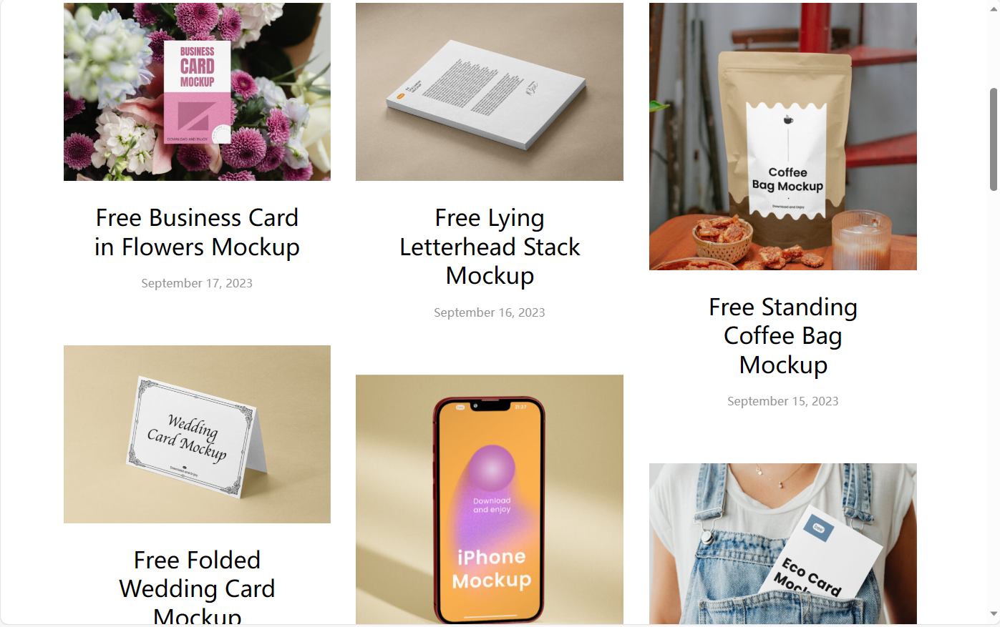

## Mockupbee
+ 类型：PSD样机资源平台
+ 商用：可免费商用
+ 限制：不限下载次数

对于设计师，样机是常用的资源，样机可以快速展示设计作品，让客户更加直观看到设计师的想法，因此国外非常流行使用实体样机展示设计作品。通过样机图展示，设计师还可以看出作品可能存在的不足，并及时优化设计方案。

 
Mockupbee一个免费高质量的实体 PSD 样机模型资源站。
1. 内容：各种类型的样机图，比如T恤、海报、杯子、手机、电脑等等，Mockupbee的样机图都是PSD格式的，完全可以自定义编辑，全部的样机图都可以免费下载。
2. 商用：所有的模型都是免版税的，可用于个人和商业项目。

 如果你是一个设计师，需要样机图来展示设计作品，那么 Mockupbee 是一个值得收藏的样机资源站。

## 传送门
> 网址：[https://mockupbee.com/](https://mockupbee.com/)
