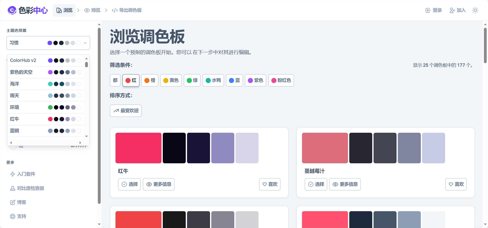

有时候，你可能会从自然界、图片或者优秀作品中获取灵感，但有时候，你可能会觉得缺乏创意或者不知道如何选择合适的颜色，感觉创作的作品总缺少灵魂，如何配色成为设计师头疼的事情之一。今天 Boss 分享一个在线调色板给你，帮助你快速地创建出各种风格和主题的颜色方案。

 

Colorhub 一个创意十足的调色板在线生成器，可以让你轻松地生成和保存你喜欢的调色板。可以根据你输入的一个颜色，自动为你生成四种不同的调色板：单色、互补、类似和三角形。这些调色板都遵循了一定的颜色理论，可以保证颜色之间的和谐和对比。同时你可以自由地调整每个颜色的色相、饱和度和亮度，以及整个调色板的温度、对比度和鲜艳度。那么实用和有趣的调色板工具，可以让你发挥你的创意，同时也可以让你学习和欣赏其他人的创意。如果你想要为你的设计或者艺术作品找到一些美丽和独特的颜色方案，不妨试试吧!

 

## Colorhub网址
传送门：[https://www.colorhub.app/browse](https://www.colorhub.app/browse)
