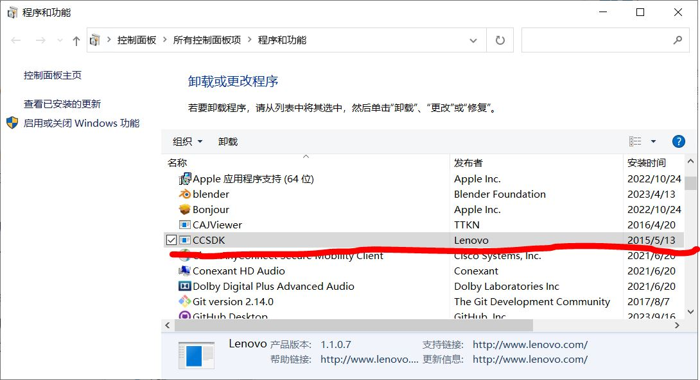
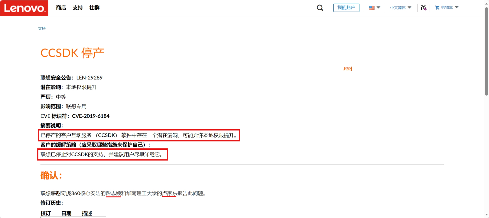
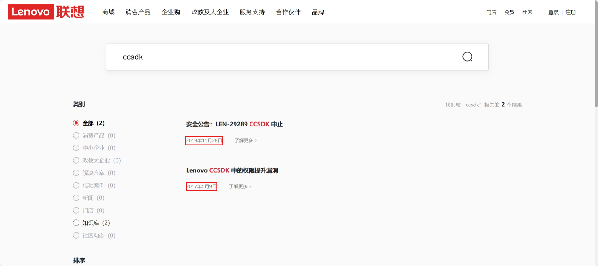

> 这是一篇日记，关于我的老古董笔记本，内容可能比较过时。

因为电脑硬盘空间不足，我今天准备删除一些不必要的软件，发现一个软件，CCSDK，由于不明白它是干嘛的，打算问问度娘能不能删除。

一番搜索没有得到满意的答案，但是我发现一条联想官网的[链接](https://support.lenovo.com/us/en/solutions/ps500284-ccsdk-discontinuation)，我毫不犹豫点了进去，毕竟官方信息可信度很高。

根据网页内容（原版为英文，已经过翻译），CCSDK早已停止服务，软件中存在一个潜在漏洞，可能允许本地权限提升，官方建议尽早删除。这下咱可以安心删除了。不得不说，咱们作为用户也要感谢 Qihoo 360 Core Security 的Zhiniang Peng 和华南理工大学的 Jiadong Lu 报告了此问题。

我到[联想官网](https://www.lenovo.com.cn/)进一步检索关于CCSDK的问题，果然有了新的发现，事实上CCSDK的权限提升漏洞在2017年就被发现并修复过，没想到停止维护之后问题又出现了。这个bug可能有它必然存在的原因。不过与我们现在都无关紧要，我们只要删除软件就没有问题了。

联想提供的服务其实很周到，有相关问题可以直接到联想官网搜索，得到的答案可能更准确。只是我们因为长期使用度娘等搜索引擎，养成了习惯，搜索此类问题反而可能走了弯路。

我们的电子设备长时间使用后要面临的问题不只是硬件落后，其中的软件也可能存在一定的安全风险，所以提醒大家要注意规避此类问题，必要的软件更新应该及时，甚至包括系统更新。

## Reference
* [ps500284-ccsdk-discontinuation](https://support.lenovo.com/us/zc/solutions/ps500284-ccsdk-discontinuation)
* [Lenovo CCSDK 中的权限提升漏洞](https://iknowledge.lenovo.com.cn/detail/157990.html)
* [安全公告：LEN-29289 CCSDK 中止](https://iknowledge.lenovo.com.cn/detail/185937.html)